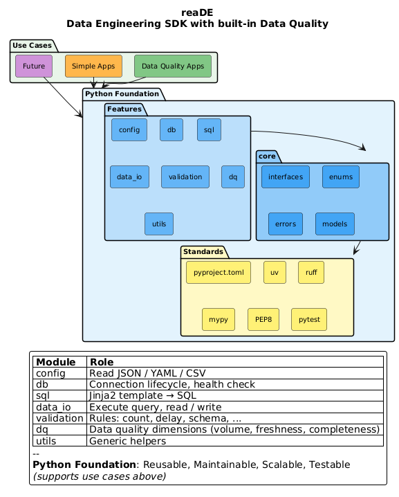

# reaDE

*Pronounced "ready" — the `DE` stands for **D**ata **E**ngineer.*

**Data Engineering SDK with built-in Data Quality — connect, query, validate.**

> Every DE, ready to ship — boilerplate handled, data quality built in.

## The Problem

**Every DE writes the same boilerplate. Every. Single. Time.**

```python
# Sound familiar?
def get_connection(db_type, host, port, ...):   # Written 100 times
def load_config(path):                          # Copy-pasted everywhere
def build_connection_string(...):               # Slightly different each time
```

Then, after shipping the pipeline, DQ never happens because:

- "I'll add validation later" → Never happens
- "Adopting a validation tool is its own project" → Skipped
- "No time, deadline tomorrow" → Technical debt

**The reality:**

| What DEs typically do | Problem |
|----------------------|---------|
| Ad-hoc `SELECT COUNT(*)` | No tracking, no alerting |
| Manual null checks | Inconsistent, forgotten |
| "I'll check it later" | Never happens |
| No freshness monitoring | Stale data goes unnoticed |
| Custom validation scripts | DRY violation, unmaintainable |

**Why DQ gets skipped:**

- **Adopting a separate validation tool** brings its own setup, config, and operational surface
- **Time pressure** — ship first, validate never
- **No integrated path** — DQ feels like "extra work" instead of a natural step in the pipeline

## What reaDE Does

reaDE is a Python SDK for the work data engineers already do — connect to a database, render a SQL template, execute it, and check the result — with data quality treated as part of the toolkit, not a separate platform you adopt.

- **Code-native** — pure Python with typed interfaces. Composable like any other library; mypy-strict at the source.
- **DQ designed in, not bolted on** — counts, freshness, nulls, schema, and custom rules share the same execution path as your queries, so writing a check has the same shape as writing a query.
- **Modular** — pick the parts you need (`config/`, `db/`, `sql/`, `data_io/`, `validation/`, `dq/`); each has a small, documented surface.
- **Stays out of your way** — runs wherever your Python runs. No hosted service, no metadata store, no UI server to operate.

Free, open-source, MIT-licensed.

## Installation

> **Not yet published to PyPI; install from source.**

```bash
# 1. Clone the repo
git clone https://github.com/Agiwar/reaDE.git
cd reaDE

# 2. Create the environment and install reaDE (resolves from uv.lock)
uv sync

# 3. Activate the environment
source .venv/bin/activate
```

## Status

reaDE is pre-alpha, being rebuilt as a [walking skeleton](DEVELOPMENT_PLAN.md):
the public API surface in `core/` lands first, then thin implementations of
the whole chain, then each module is hardened in release-gated sprints.

The entire chain now runs end-to-end against SQLite — see
[`examples/end_to_end.py`](examples/end_to_end.py):

```python
from reade.config import ConfigLoaderFactory, YamlLoader
from reade.db import SqliteConnector
from reade.sql import render_template
from reade.data_io import execute_query
from reade.validation import RowCountRule
from reade.dq import VolumeDimension
```

> **Alpha caveat:** SQL templating interpolates identifiers (e.g.
> `{{ table }}`) without sanitization — parameter safety is Phase 2
> scope. Do not render templates with untrusted input.

### Module Status

| Module | Status | Notes |
|--------|--------|-------|
| `core/` | ✅ API surface | Protocols, enums, errors, models, base ABCs |
| `config/` | ✅ Hardened (1.1) | YAML / JSON → typed objects; search paths; env overrides |
| `db/` | ✅ Hardened (1.2) | SQLite / PostgreSQL / MySQL; lifecycle, health check, connect retry; dockerized integration tests |
| `sql/` | ✅ Thin slice | One Jinja2 template (`row_count`); discovery convention in Phase 2 |
| `data_io/` | ✅ Thin slice | Execute query → rows; readers/writers (incl. CSV) in Phase 2 |
| `validation/` | ✅ Thin slice | Row-count rule; more rules in Phase 3 |
| `dq/` | ✅ Thin slice | Volume dimension; more dims in Phase 3 |

Earlier prototype implementations are being re-landed sprint by sprint.

## Configuration

Config files validate into typed objects at the `config/` boundary;
everything past it takes plain parameters.

```yaml
# db.yaml
database: "local.db"
```

```bash
# Deploy-time override — no file edit, no code change.
export READE__SQLITE__DATABASE="/var/data/prod.db"
```

```python
from reade.config import SqliteConfig, load_config
from reade.db import SqliteConnector

# resolve → parse → env overrides → validate
config = load_config("db.yaml", model=SqliteConfig)

with SqliteConnector(database=config.database) as connector:
    print(connector.ping())  # True
```

- **Formats:** YAML (`.yaml` / `.yml`) and JSON (`.json`). CSV is data,
  not config — it arrives as a `data_io` reader in Phase 2.
- **Resolution:** a relative name is tried against `search_paths` in
  order (default: the current working directory only); absolute paths
  bypass the search; a miss raises `FileNotFoundError` listing every
  directory searched. The SDK reads no environment variables for file
  location — applications wanting an env-var convention pass
  `os.environ[...]` into `search_paths` themselves.
- **Env overrides:** every model reads its own namespace —
  `READE__<PREFIX>__KEY` (`SqliteConfig` → `READE__SQLITE__DATABASE`,
  `PostgresConfig` → `READE__POSTGRES__HOST`) — and ignores variables
  outside it, so several configs share one process environment without
  collisions. An environment value overrides the file value (the only
  precedence rule); values arrive as raw strings and the model coerces
  and validates them. A typo'd variable inside the namespace fails
  loudly with a field path — unknown fields are rejected. Pass
  `environ={}` to disable overrides for a call, or a filtered mapping
  to substitute the process environment.
- **Validation failures** raise reaDE's own `ConfigError` carrying the
  field-path report; `ConfigLoader.load(path)` remains the untyped
  dict layer underneath.

See [`examples/config_typed.py`](examples/config_typed.py) for the full
flow, including a rejected typo'd override.

## Database Connections

Three connectors share one contract — connect, ping, execute, close —
behind `ConnectionInterface`; server drivers install as extras
(`reade[postgres]`, `reade[mysql]`, `reade[all]`).

```python
from reade.config import PostgresConfig, load_config
from reade.db import PostgresConnector

config = load_config("postgres.yaml", model=PostgresConfig)

with PostgresConnector(
    host=config.host,
    database=config.database,
    user=config.user,
    password=config.password,
    port=config.port,
    connect_attempts=config.connect_attempts,  # retry is deploy-tunable
) as connector:
    connector.ping()                      # round-trip health check
    rows = connector.execute("SELECT 1")  # [(1,)]
```

- **Every `execute()` is atomic and immediately durable, on every
  backend.** Connections run in autocommit mode: no commit calls, a
  failed statement cannot wedge the connection (health checks keep
  working), and writes survive `close()`. Callers needing transactions
  manage them through the `connection` property.
- **Retry is connect-scoped only** — bounded attempts, doubling backoff
  capped at 30s, optional per-attempt `connect_timeout` (set it on
  PostgreSQL: libpq otherwise waits indefinitely). Statement execution
  and `ping()` are never retried: retrying writes repeats non-idempotent
  work, and a health check that retries stops being a measurement.
- **Known limitations (v0.1.x):** no TLS or charset parameters yet — a
  scheduled follow-up. Interim, PostgreSQL honors libpq's standard
  [environment variables](https://www.postgresql.org/docs/current/libpq-envars.html)
  (`PGSSLMODE`, `PGSSLROOTCERT`, …) for any parameter the connector does
  not set explicitly; MySQL over TLS is not yet reachable.
- The `postgres` extra pins `psycopg[binary]` (bundled libpq) so the
  install works without system PostgreSQL libraries; the trade-off is
  that libpq security updates arrive with psycopg releases rather than
  through your OS package manager.

See [`examples/db_typed.py`](examples/db_typed.py) for the full chain —
scoped config, override namespacing, and the connector lifecycle against
a real server (CI runs it against a dockerized PostgreSQL; locally, start
`tests/integration/compose.yaml`).

## MVP Scope

**Core database support** — the base install stays light; server drivers
are opt-in extras:
- SQLite — stdlib, no extra needed
- PostgreSQL — `pip install 'reade[postgres]'` (psycopg 3)
- MySQL — `pip install 'reade[mysql]'` (PyMySQL)
- Both servers — `pip install 'reade[all]'`

**Planned (not yet shipped):**
- Trino (analytics engine connector)

**Not in MVP:**
- Oracle, DB2, ClickHouse, Snowflake
- Spark, dbt integration
- Orchestration, CDC, streaming

## Architecture



<sub>Diagram source: [`docs/reade_overview.puml`](docs/reade_overview.puml) — regenerate `reade_overview.png` after editing it.</sub>

**reaDE is a Data Engineering SDK that unifies:**

| Module | Responsibility |
|--------|---------------|
| `config/` | Parse YAML / JSON → typed objects |
| `db/` | Connection lifecycle, health check |
| `sql/` | Render Jinja2 templates → SQL strings |
| `data_io/` | Execute SQL, external I/O (incl. CSV readers) |
| `validation/` | Schema, type, and rule validation |
| `dq/` | Data quality dimension aggregation |

**Data Flow:**
```
config/ → db/ → sql/ → data_io/ → validation/ → dq/
  │        │      │        │           │          │
parse   connect  render  execute    validate   aggregate
```

**DQ is powered by the other layers — the synergy is the value.**

## Project Structure

```
src/reade/
├── core/           # Shared foundation (the frozen public API surface)
│   ├── base/       # ABCs with shared behavior (ConnectionBase, FileLoaderBase)
│   ├── enums/      # DbType, FileType
│   ├── errors/     # Exception hierarchy rooted at ReadeError
│   ├── interfaces/ # Protocol definitions (contracts)
│   └── models/     # Shared data models (DbMetadata)
├── config/         # YAML loader + loader factory
├── db/             # SQLite connector
├── sql/            # Jinja2 template rendering + packaged templates
├── data_io/        # Query execution
├── validation/     # Row-count rule
└── dq/             # Volume dimension
```

Each feature module is a thin slice that deepens in its hardening sprint —
see [ARCHITECTURE.md](ARCHITECTURE.md) for the target layout and dependency
chain.

## Development

```bash
# Setup (installs dev tools from locked versions)
uv sync --extra dev
source .venv/bin/activate

# Commands
make help          # Show all commands
make lint          # Run ruff linter
make type-check    # Run mypy
make test          # Run tests
make check-all     # Run all checks
```

## License

MIT License

## Author

**Jeffrey Li** - [@Agiwar](https://github.com/Agiwar)
